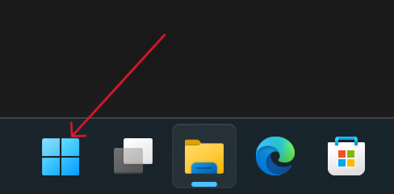
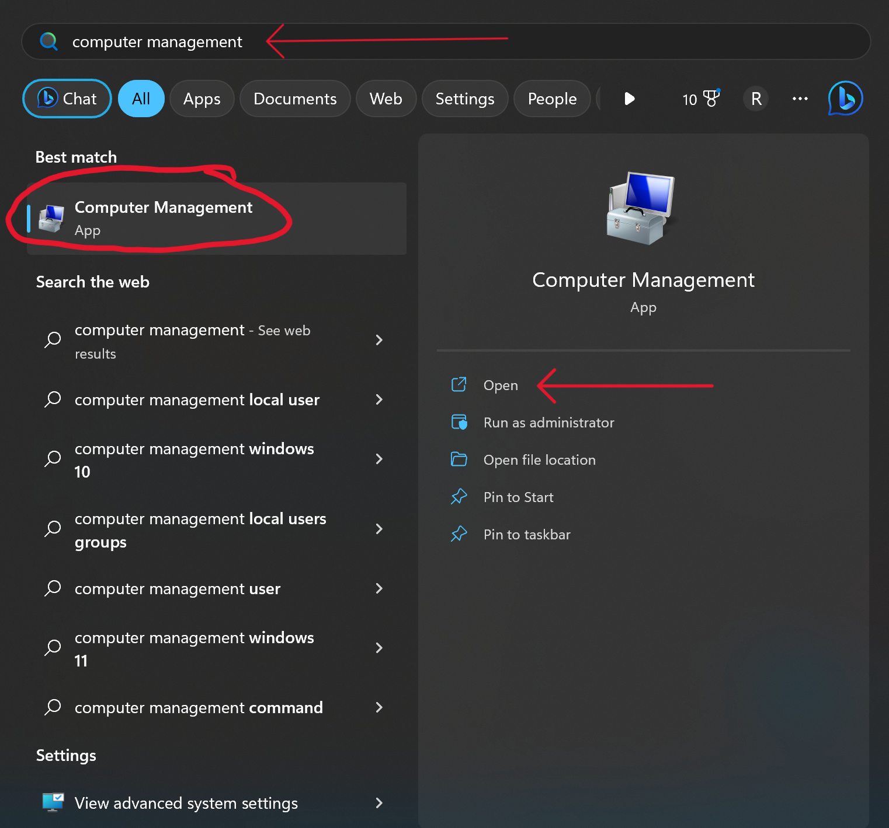
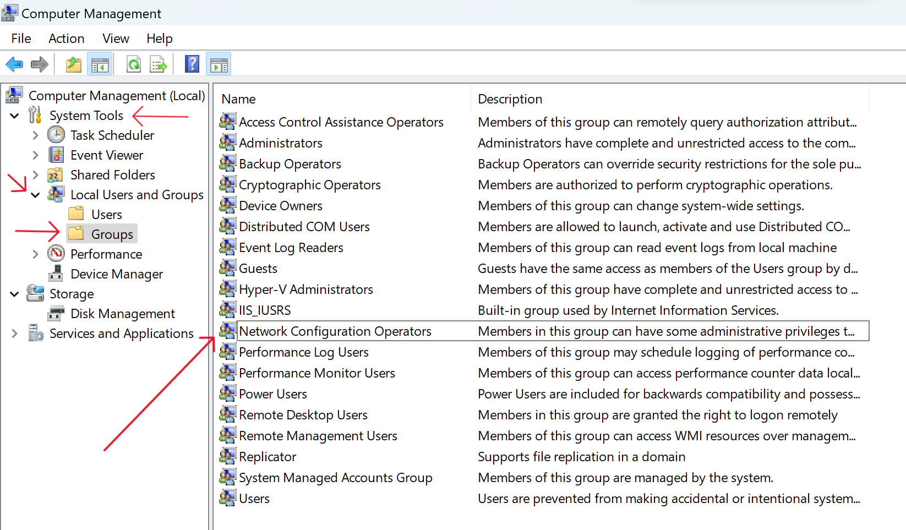
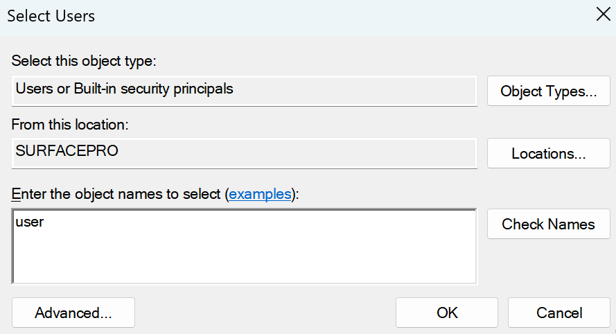
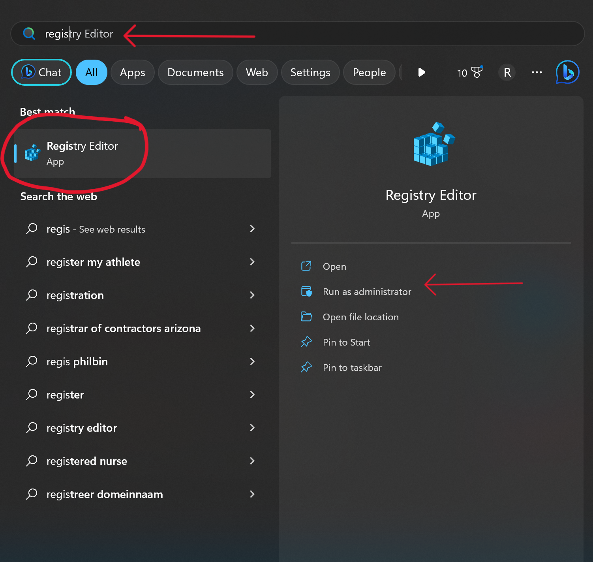
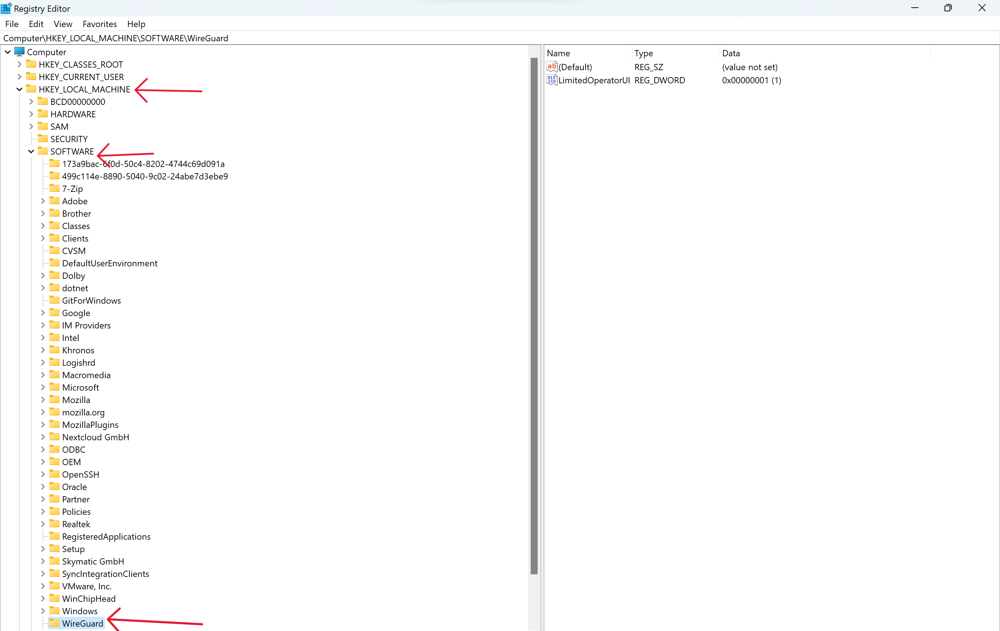
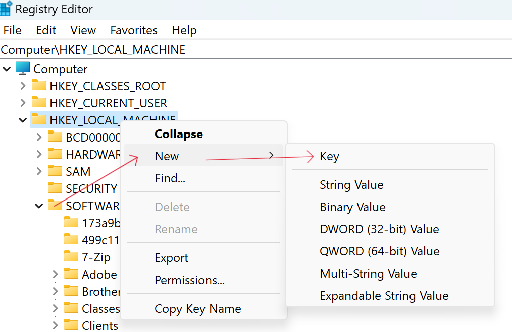
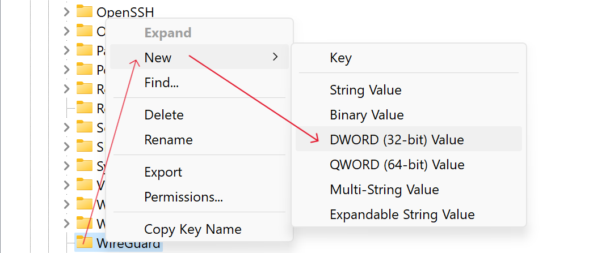

WireGuard® is an extremely simple yet fast and modern VPN that utilizes state-of-the-art cryptography. It aims to be faster, simpler, leaner, and more useful than IPsec, while avoiding the massive headache. It intends to be considerably more performant than OpenVPN. WireGuard is designed as a general purpose VPN. **However**, WireGuard will not run on Windows when the user is a non-administrator account.

Unlike other VPN tools and technologies, the Wireguard client creates a tunnel interface (showing up as a network adapter) for each connection you have configured *when you try to connect*, aka "on the fly". When you terminate the connection the client deletes the tunnel interface entirely. It does this outside the official VPN plumbing of Windows. That design has the severe limitation that you need to be an administrator of the machine so the software can create the interface.

There are two possible workarounds to enable the WireGuard interface.

1. Switch to the administrator account to activate WireGuard than switch back to the standard user account.
    - Pro: admin user has access to all WireGuard GUI
    - Con: it takes time to switch between accounts
2. Add a registry key and add user to the `Network Configuration Operators` group.
    - Pro: WireGuard GUI is accessible
    - Con: messing with registry, GUI functionality severely limited, messes with privilege elevation prompt
    
    ### Network Configuration Operators

    Members of the Network Configuration Operators group can have the following administrative privileges to manage configuration of networking features:

    - Modify the Transmission Control Protocol/Internet Protocol (TCP/IP) properties for a local area network (LAN) connection, which includes the IP address, the subnet mask, the default gateway, and the name servers.
    - Rename the LAN connections or remote access connections that are available to all the users.
    - Enable or disable a LAN connection.
    - Modify the properties of all remote access connections of users.
    - Delete all the remote access connections of users.
    - Rename all the remote access connections of users.
    - Issue `ipconfig`, `ipconfig /release`, and `ipconfig /renew` commands.
    - Enter the PIN unblock key (PUK) for mobile broadband devices that support a SIM card.
        
    This group appears as an SID until the domain controller is made the primary domain controller and it holds the operations master (FSMO) role. This group can't be renamed, deleted, or removed.

    The Network Configuration Operators group applies to the Windows Server operating system in Default Active Directory security groups.

## How to add a User to a Group on Windows

    The images below are captured from Windows 11. However, the same steps apply to Windows 10, but they may look slightly different.

1. From the administrator account, open your computer's Start menu. The Start menu button looks like a Windows icon on your desktop taskbar.
  
2. Type `Computer Management` and click *Open*
    
3. Click on `System Tools` drop down to expose `Local Users and Groups`. Then click on the drop down to expose the `Groups` folder. Click on the `Groups` folder that will display on the groups in the right-hand pane. You can now double-click on `Network Configuration Operators`.
   
4. Click the *Add...* button
    
5. Add each user by typing the name into the block and then pressing *Check Names*. Repeat this for each user on the computer. Then press *OK*.
    

## How to add a registry key

    The images below are captured from Windows 11. However, the same steps apply to Windows 10, but they may look slightly different.

1. From the administrator account, open your computer's Start menu. The Start menu button looks like a Windows icon on your desktop taskbar.
    
2. Type `Registry Editior` and click *Open*
    
3. Navigate to `Computer\HKEY_LOCAL_MACHINE\SOFTWARE\`. If you have a WireGuard folder, skip the next step.
    
4. If you do not have a WireGuard folder, right-click on `SOFTWARE` and select New -> Key and type "WireGuard"
    
5. On the WireGuard folder, right-click and choose New -> `DWORD (32-bit) Value` and name it `LimitedOperatorUI`
    
6. Double-click on the new DWORD and enter `1` for the value.
    
7. Press *OK* and close all the windows. Restart the computer. Users should now be able to start the WireGuard client to connect.

---

    When this key is set to DWORD(1), the UI will be launched on desktops of users belonging to the Network Configuration Operators builtin group (S-1-5-32-556), with the following limitations for members of that group:

        - Configurations are stripped of all public, private, and pre-shared keys;
        - No version update popup notifications are shown, and updates are not permitted, though a tab still indicates the availability;
        - Adding, removing, editing, importing, or exporting configurations is forbidden; and
        - Quitting the manager is forbidden.
        
    However, basic functionality such as starting and stopping tunnels remains intact.

---
### References

  - [StackExchange superuser forum](https://superuser.com/questions/1488844/issues-running-wireguard-on-windows-10-as-non-administrator-ui-is-only-access#1527973)
  - [Jason A. Donenfeld (zx2c4)](https://git.zx2c4.com/wireguard-windows/about/docs/adminregistry.md)
  - [Microsoft Understand Security Groups](https://learn.microsoft.com/en-us/windows-server/identity/ad-ds/manage/understand-security-groups#network-configuration-operators)